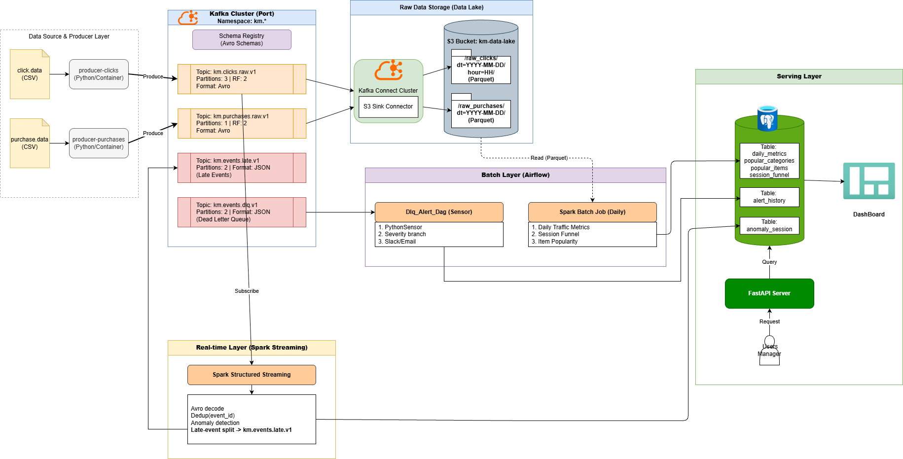

# Clickstream Guardian

**실시간 클릭스트림 이상 탐지와 일일 KPI 집계를 통합한 E2E 데이터 파이프라인**



---

## 프로젝트 배경

대규모 트래픽 이커머스 환경에서는 봇 클릭, 세션 하이재킹 등 비정상 사용자 행위를 **실시간으로** 탐지하는 것이 매우 중요합니다. 동시에, 장애 시 **데이터 무손실**을 보장하고 비즈니스 의사결정을 위한 **일별 KPI 대시보드**를 제공해야 합니다.

**Clickstream Guardian**은 프로덕션 수준의 파이프라인으로 이를 해결합니다:
- Kafka(3-브로커 클러스터)를 통한 클릭/구매 이벤트 수집
- Spark Structured Streaming으로 실시간 이상 세션 탐지
- Airflow 오케스트레이션 기반 Spark 배치 잡으로 일별 KPI 지표 산출
- FastAPI REST API와 Streamlit 대시보드를 통한 결과 서빙
- DLQ 알림 및 SLO 리포트를 통한 데이터 품질 모니터링

---

## 아키텍처

```
Producer ──► Kafka (3 Brokers) ──► Spark Structured Streaming ──► PostgreSQL ──► FastAPI / Streamlit
                    │
                    ├──► Kafka Connect ──► MinIO (S3) ──► Spark Batch (Airflow) ──► PostgreSQL
                    │
                    └──► DLQ Topic ──► Airflow Sensor ──► Slack / Email Alert
```

---

## 기술 스택

| 계층 | 기술 |
|------|------|
| 수집 | Apache Kafka (3 brokers), Confluent Schema Registry, Avro |
| 스트림 처리 | Spark Structured Streaming |
| 배치 처리 | Apache Spark, Apache Airflow |
| 저장 | PostgreSQL (파티션 테이블), MinIO (S3 호환) |
| 서빙 | FastAPI, Streamlit |
| 인프라 | Docker Compose (헬스체크 포함) |
| 테스트 | pytest, Locust, smoke test, failure injection, SLO 리포트 |

---

## 주요 기능

1. **실시간 이상 탐지** — Spark Structured Streaming 기반 두 가지 탐지 알고리즘
   - **HIGH_FREQUENCY**: 10초 텀블링 윈도우에서 고빈도 클릭 세션 탐지
   - **BOT_LIKE**: 1분 슬라이딩 윈도우에서 고빈도 + 저다양성(봇 패턴) 세션 탐지
2. **Kafka 내구성 보장** — `acks=all`, 멱등성 프로듀서, 복제 계수 2로 메시지 손실 방지
3. **데이터 계약 강제** — Avro 스키마 + Schema Registry로 프로듀서/컨슈머 호환성 보장
4. **Dead Letter Queue (DLQ)** — 실패 이벤트를 DLQ로 전송하고 Airflow 기반 자동 알림 + `alert_history` 중복 제거
5. **일별 KPI 파이프라인** — Airflow DAG가 Spark 배치 잡 오케스트레이션 (지표, 인기 아이템, 전환 퍼널) + `pipeline_runs` 테이블에 실행 이력 기록
6. **자동 파티션 관리** — Airflow DAG가 `anomaly_sessions` 테이블의 향후 7일치 파티션 생성 및 30일 이전 파티션 정리
7. **지연 이벤트 & 중복 처리** — Watermark + `event_id` 기반 중복 제거, 지연 이벤트 전용 Kafka 토픽 분리
8. **보안** — 모든 비밀번호를 환경변수로 관리, 미설정 시 즉시 실패 (fail-fast)
9. **관측성** — SLO 리포트, 부하 테스트(Locust), 장애 시뮬레이션, smoke 테스트

---

## 주요 설계 결정

| 결정 사항 | 근거 |
|-----------|------|
| `acks=all` + `enable.idempotence=true` | 약간의 지연을 감수하고 메시지 손실을 방지하는 내구성 우선 Kafka 설정 |
| Avro + Schema Registry | 프로듀서-컨슈머 간 데이터 계약 강제 및 스키마 진화 지원 |
| 이벤트 타임 윈도잉 + Watermark | 지연 이벤트는 state에서 자동 정리되고, 별도 토픽으로 분리하여 데이터 무손실 보장 |
| DLQ 임계값 기반 알림 + 중복 제거 | 알림 피로를 방지하면서 데이터 품질 이슈 가시성 확보 |
| Atomic batch write (스테이징 테이블 스왑) | 단일 트랜잭션 내 delete + insert로 부분 쓰기 방지, 멱등성 보장 |
| API 커넥션 풀링 | `ThreadedConnectionPool`로 요청별 연결 생성 오버헤드 제거 |
| 환경변수 기반 비밀 관리 (fail-fast) | 하드코딩 제거, 미설정 시 즉시 에러로 런타임 장애 사전 방지 |
| MinIO (로컬 S3 호환 스토리지) | 클라우드 없이 Kafka Connect S3 싱크 및 Spark 배치 잡 로컬 검증 가능 |
| Docker 헬스체크 + `depends_on: condition` | 서비스 기동 순서를 보장하여 race condition 방지 |

---

## 시작하기

### 사전 요구사항

- Docker Desktop
- Python 3.10+
- Bash 환경 (Windows의 경우 Git Bash / WSL)

### 빠른 시작

```bash
# 1. 환경 설정
cp .env.example .env
# .env 편집 — POSTGRES_PASSWORD, AWS 자격증명 등 설정

# 2. 서비스 빌드 및 시작
docker compose -f docker/docker-compose.yml build
docker compose -f docker/docker-compose.yml up -d

# 3. (선택) 데이터베이스 마이그레이션 적용
bash scripts/apply_migration.sh
```

### 테스트 실행

```bash
# 단위 테스트 — API 엔드포인트 및 프로듀서 로직 검증
pytest

# Smoke 테스트 — 모든 엔드포인트 정상 여부 확인
bash scripts/run_local_smoke.sh

# 부하 테스트 — 15명 동시 사용자, 20초간 실행
python -m locust -f scripts/load_test.py --host http://localhost:8000 \
    --headless -u 15 -r 5 -t 20s --only-summary

# 장애 주입 — Kafka 브로커 중단/재시작
python scripts/failure_simulation.py --mode stop-start --down-seconds 20
```

### 서비스 접속 정보

| 서비스 | URL |
|--------|-----|
| API | http://localhost:8000 |
| API 문서 (Swagger) | http://localhost:8000/docs |
| 대시보드 | http://localhost:8501 |
| Airflow | http://localhost:8082 |

---

## 프로젝트 구조

```
├── api/                    # FastAPI REST API
│   ├── routers/            # 엔드포인트 모듈 (anomalies, metrics, items)
│   └── models/             # 데이터베이스 연결 유틸리티 (커넥션 풀)
├── producers/              # Kafka 프로듀서 (클릭, 구매, DLQ 데모)
├── spark-streaming/        # Spark Structured Streaming 이상 탐지기
├── spark-batch/            # 일별 지표, 인기 아이템, 세션 퍼널
│   └── common/             # 공유 유틸리티 (S3, PostgreSQL atomic write)
├── airflow/dags/           # Airflow DAG (배치 오케스트레이션, DLQ 알림, 파티션 관리)
├── dashboard/              # Streamlit 대시보드
├── schemas/                # Avro 스키마 (클릭, 구매, 이상 이벤트)
├── connectors/             # Kafka Connect S3 싱크 설정
├── docker/                 # Docker Compose 및 서비스 Dockerfile
├── tests/                  # pytest 단위 테스트 (API, 프로듀서, Spark, Airflow)
├── scripts/                # 테스트 및 운영 스크립트
├── data/                   # 데이터 전처리 유틸리티
└── docs/                   # 프로젝트 문서 및 리포트
```

---

## 품질 & 테스트

| 테스트 유형 | 도구/스크립트 | 목적 |
|-------------|---------------|------|
| 단위 테스트 | `pytest` (`tests/`) | API, 프로듀서, Spark 배치, Spark 스트리밍, Airflow DAG 검증 |
| Smoke 테스트 | `scripts/smoke_test.py` | API 엔드포인트 응답 확인 |
| 부하 테스트 | `scripts/load_test.py` (Locust) | 동시 사용자 부하에서 API 처리량 측정 |
| 장애 주입 | `scripts/failure_simulation.py` | Kafka 브로커 장애 시 파이프라인 복원력 검증 |
| 처리량 테스트 | `scripts/producer_throughput_test.py` | 프로듀서 메시지 처리량 측정 |
| SLO 리포트 | `scripts/generate_slo_report.py` | 파이프라인 단계별 지연 백분위 리포트 생성 |

> **참고**: Spark/Airflow 테스트는 해당 의존성이 설치된 환경(Docker 컨테이너 등)에서 실행됩니다. 로컬에서는 `pytest.importorskip`으로 자동 건너뜁니다.

---

## 문서

- [테스트 실행 리포트 (2026-02-22)](docs/TEST_EXECUTION_REPORT_2026-02-22.md)
- [지표 요약 (2026-02-22)](docs/METRICS_SUMMARY_2026-02-22.md)

---

## 향후 개선 사항

- [ ] GitHub Actions CI 파이프라인 추가 (lint, 단위 테스트, Docker 빌드)
- [ ] Prometheus + Grafana 기반 실시간 메트릭 모니터링
- [ ] `ruff` / `black`을 활용한 자동 코드 포매팅
- [ ] Kubernetes 배포 매니페스트 작성 (프로덕션 준비)
