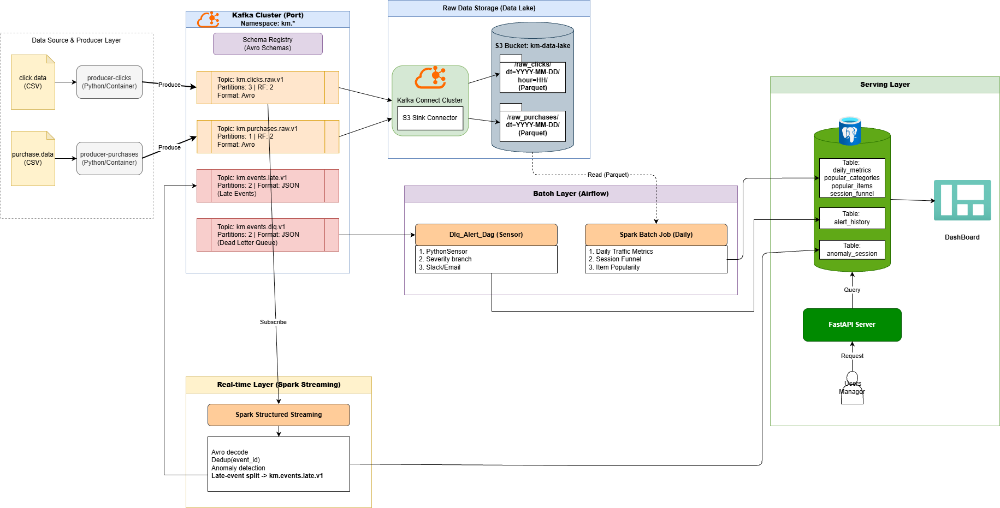

# Clickstream Guardian

실시간 클릭스트림 이상 탐지와 일별 커머스 지표 집계를 위한 E2E 데이터 파이프라인 프로젝트입니다.



## 개요

Clickstream Guardian은 이커머스 클릭/구매 이벤트를 수집하고, 이상 세션을 실시간에 가깝게 탐지하며, 원천 이벤트를 데이터 레이크에 저장한 뒤 일별 분석 지표를 계산하는 로컬 데이터 플랫폼입니다. 최종 결과는 FastAPI와 Streamlit 대시보드를 통해 조회할 수 있습니다.

이 프로젝트는 데이터 엔지니어링 면접에서 설명하기 좋은 주제에 초점을 맞췄습니다.

- Kafka, Avro, Schema Registry 기반 이벤트 수집
- Spark Structured Streaming 기반 실시간 처리
- Airflow와 Spark 기반 배치 분석
- Kafka Connect와 MinIO를 이용한 로컬 데이터 레이크
- PostgreSQL 기반 분석 테이블, 파이프라인 실행 이력, 알림 이력 관리
- smoke test, 부하 테스트, 장애 시뮬레이션, SLO 리포트를 통한 검증

## 아키텍처

```text
Producer
  -> Kafka + Schema Registry
    -> Spark Structured Streaming -> PostgreSQL -> FastAPI -> Streamlit
    -> Kafka Connect S3 Sink -> MinIO -> Spark Batch via Airflow -> PostgreSQL
    -> DLQ / late-event topic -> Airflow alerting
```

## 기술 스택

| 영역 | 기술 |
|---|---|
| 이벤트 수집 | Apache Kafka, Confluent Schema Registry, Avro |
| 스트리밍 처리 | Spark Structured Streaming |
| 배치 처리 | Spark, Airflow |
| 저장소 | PostgreSQL, MinIO |
| 서빙 | FastAPI, Streamlit |
| 검증 | pytest, smoke test, Locust, failure simulation, SLO report |
| 실행 환경 | Docker Compose |

## 구현 기능

- Kafka 3 broker 클러스터와 명시적인 topic 생성
- click, purchase, anomaly 이벤트용 Avro schema
- `acks=all`, idempotence, compression, delivery callback을 적용한 producer
- Spark Streaming 기반 high-frequency / bot-like 세션 탐지
- event-time window, watermark, event id 중복 제거, late event 분리
- Kafka Connect S3 Sink를 통한 MinIO 적재
- Airflow DAG 기반 daily metrics, popular items, session funnel, partition 관리, DLQ 알림
- PostgreSQL index, anomaly partition, pipeline run history, alert history, analytics table
- metrics, anomalies, popular items, health, stats 조회용 FastAPI
- 일별 KPI, funnel, popular items, anomaly 모니터링용 Streamlit dashboard

## 주요 설계 결정

| 영역 | 설계 |
|---|---|
| Kafka 내구성 | `acks=all`, producer idempotence, replicated topic으로 메시지 손실 위험을 낮췄습니다. |
| Schema 관리 | Avro와 Schema Registry로 producer-consumer 간 데이터 계약을 강제했습니다. |
| Streaming 정확성 | event-time window, watermark, deduplication, late-event topic을 사용했습니다. |
| Batch 멱등성 | staging table에 먼저 적재한 뒤 단일 transaction으로 final table에 반영합니다. |
| 운영성 | pipeline run, DLQ alert, SLO timestamp, failure simulation 결과를 남깁니다. |

## 로컬 실행

필수 환경:

- Docker Desktop
- Python 3.10+
- Bash 실행 환경

```bash
cp .env.example .env
docker compose -f docker/docker-compose.yml build
docker compose -f docker/docker-compose.yml up -d
bash scripts/apply_migration.sh
```

주요 서비스:

| 서비스 | URL |
|---|---|
| API | http://localhost:8000 |
| Swagger | http://localhost:8000/docs |
| Dashboard | http://localhost:8501 |
| Airflow | http://localhost:8082 |

## 검증 방법

```bash
pytest
python scripts/smoke_test.py --base-url http://localhost:8000
python -m locust -f scripts/load_test.py --host http://localhost:8000 --headless -u 15 -r 5 -t 20s --only-summary
python scripts/failure_simulation.py --mode stop-start --down-seconds 20
python scripts/generate_slo_report.py --hours 24
```

최근 검증 결과:

- [테스트 실행 리포트](docs/TEST_EXECUTION_REPORT_2026-02-22.md)
- [지표 요약](docs/METRICS_SUMMARY_2026-02-22.md)

## 디렉터리 구조

```text
api/                 FastAPI 서비스
airflow/dags/        Airflow DAG
connectors/          Kafka Connect S3 Sink 설정
dashboard/           Streamlit 대시보드
docker/              Docker Compose 및 서비스 이미지
docs/                검증 결과 문서
producers/           Kafka 이벤트 producer
schemas/             Avro schema
scripts/             smoke, load, migration, SLO, failure script
spark-batch/         일별 배치 분석 job
spark-streaming/     실시간 이상 탐지 job
tests/               단위 테스트 및 import 테스트
```

## 현재 한계

- 로컬 Docker 기반 시연에 최적화되어 있으며, managed cloud 배포 환경은 포함하지 않았습니다.
- Spark와 Airflow 관련 일부 테스트는 로컬 의존성이 없으면 skip됩니다.
- SLO 수치는 제한된 검증 실행 결과이므로 운영 기준으로 사용하려면 더 긴 트래픽 테스트가 필요합니다.
- 인증, secret 관리, production observability는 최소 수준으로만 구성했습니다.

## 다음 개선 과제

- GitHub Actions로 test, lint, Docker build 검증 자동화
- dashboard에 `pipeline_runs`, `alert_history`, late-event count, SLO percentile 노출
- Airflow data quality check 추가: row count, null rate, duplicate event id, schema drift
- broker 장애 발생부터 감지, 복구, 영향 측정까지 하나의 장애 대응 시나리오로 문서화
